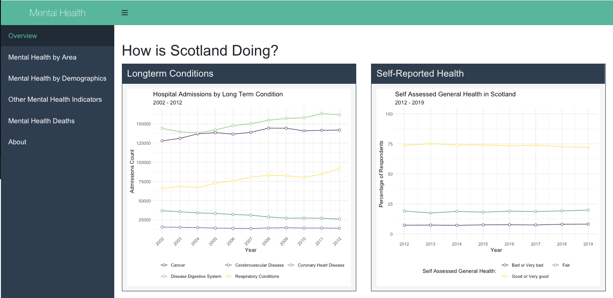
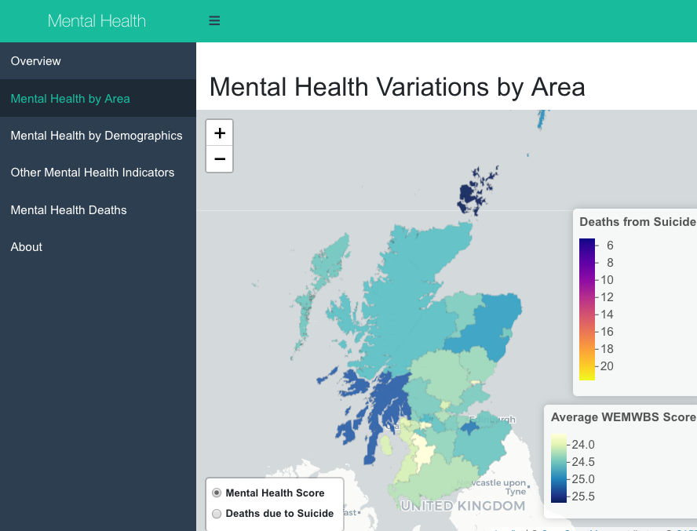
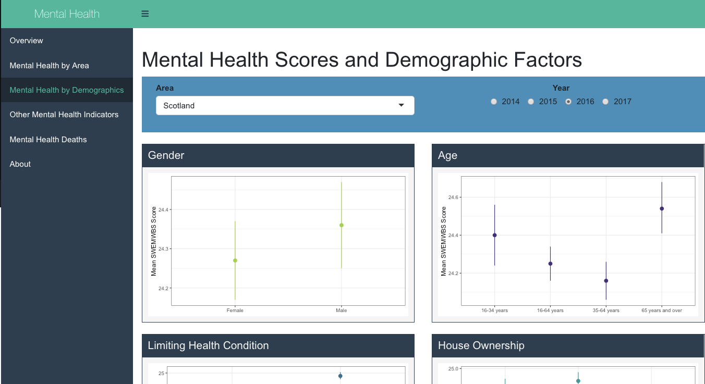
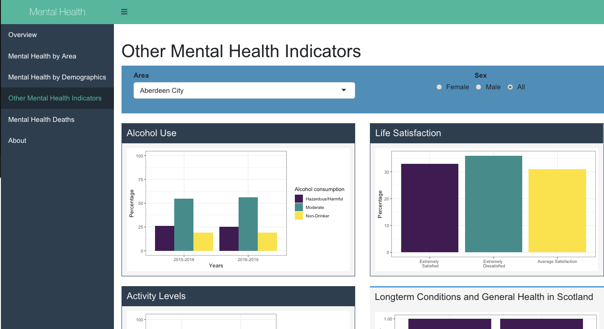
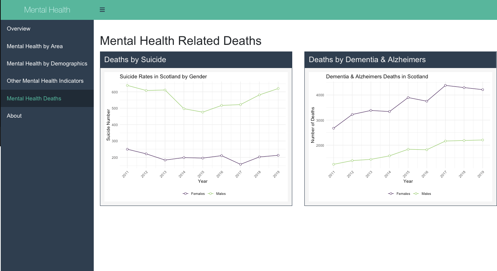

# Mental Health Dashboard

### Introduction

###### This project looks to utilise the data available from the [STATISTICS.GOV.SCOT](https://statistics.gov.scot/home) site to develop a dashboard showing how mental health metrics between different local authority areas have changed over time and see how each area is performing. 

###### This was made using [RStudio](https://rstudio.com/) and the package [Shiny](https://shiny.rstudio.com/) for a group project as part of the Data Analysis course at the [CodeClan](https://codeclan.com/) organisation.

### Initial Steps

###### Data in the form of .csv or Excel files was downloaded from the the aforementioned [STATISTICS.GOV.SCOT](https://statistics.gov.scot/home) site and examined with the accompanying material to become familiar with how the data was gathered and what the key values meant.

###### It was decided that due to most of the data that was chosen having information at the local authority level that this would be the appropriate level for our dashboard to focus on mainly. Data was was filtered to the local authority level (32 local authorities in Scotland) and using the specific codes for these from [Datazone lookup file](https://statistics.gov.scot/data/data-zone-lookup) from the [STATISTICS.GOV.SCOT](https://statistics.gov.scot/home) to ensure that all names were standardised.

### Packages Used

###### In order to display our geographic information the package [leaflet](https://rstudio.github.io/leaflet/) was utilised to construct interactive maps that conveyed the data we had collected.

###### The local authority boundaries were obtained from the [OS Data Hub](https://osdatahub.os.uk/downloads/open/BoundaryLine?_ga=2.224291931.1146669782.1611403147-115211834.1611403147) site (available as part of their OpenData downloads)

###### To construct the dashboard, the R package [shinydashboard](https://rstudio.github.io/shinydashboard/) to present our information in a visually pleasing tabbed format. 

### Team

* Sarina Singh Khaira
* Stephanie Duncan
* Rashpal Singh
* Graeme Anderson

### App Demo

 
 

 
 

 
 

 
 

### Credits and Links to Data Sources

[Mental Wellbeing Survey](https://statistics.gov.scot/resource?uri=http%3A%2F%2Fstatistics.gov.scot%2Fdata%2Fmental-wellbeing-sscq)
 
 
[Life Expectancy in Scotland](https://statistics.gov.scot/resource?uri=http%3A%2F%2Fstatistics.gov.scot%2Fdata%2FLife-Expectancy)

[Life Expectency UK Wide](https://statistics.gov.scot/resource?uri=http%3A%2F%2Fstatistics.gov.scot%2Fdata%2FLife-Expectancy)
 
 
[General Health Survey](https://statistics.gov.scot/resource?uri=http%3A%2F%2Fstatistics.gov.scot%2Fdata%2Fgeneral-health-sscq)
                                  
[Scottish Index of Multiple Deprivation 2020](https://www.gov.scot/publications/scottish-index-of-multiple-deprivation-2020v2-ranks/)
                    
[Scottish Health Survey](https://statistics.gov.scot/resource?uri=http%3A%2F%2Fstatistics.gov.scot%2Fdata%2Fscottish-health-survey-local-area-level-data",
                                   "Scottish Health Survey")
[Hospital Admissions](https://statistics.gov.scot/resource?uri=http%3A%2F%2Fstatistics.gov.scot%2Fdata%2Fhospital-admissions)

[Probable Suicides](https://www.nrscotland.gov.uk/statistics-and-data/statistics/statistics-by-theme/vital-events/deaths/suicides)
                            

